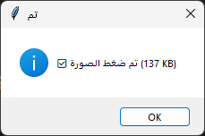

# 📸 tameronline-foto

A lightweight desktop tool to resize and compress images using Python and a simple GUI built with Tkinter.  
Designed to reduce image size without significant quality loss, with automatic compression and dimension adjustment.

## 🚀 Features

- Compress images to under 300KB (or any specified target).
- Resize images (default: 800x800 pixels).
- Supports common formats: JPG, PNG, WEBP, BMP.
- Simple graphical interface.
- User alerts for success or failure of the operation.

## 🖥️ Screenshot (optional)


## 🧰 Requirements

```bash
pip install -r requirements.txt
```

- `pillow` – For image processing.
- `pyinstaller` – To optionally build an executable file.

## 🛠️ Usage

1. Run the script `myfoto.py`.
2. Select an image from your system.
3. The image will be resized and compressed to the same directory with a name like `image_compressed.jpg`.
4. A message box will confirm whether the compression was successful.

### From terminal (optional)
```bash
python myfoto.py
```

## 🧱 Project Structure

```
tameronline-foto/
├── README.md              ← This file
├── LICENSE                ← Apache 2.0 license
├── myfoto.py              ← Main script for GUI and image processing
└── requirements.txt       ← Required libraries
```

## 📦 Build Executable (Optional)

You can use `PyInstaller` to generate an executable:

```bash
pyinstaller --onefile myfoto.py
```

The executable will appear in the `dist/` folder.

## 📥 Downloads

- [⬇️ Download myfoto.exe](https://github.com/TamerOnLine/foto/releases/download/v1.0.0/myfoto.exe)
- [📦 Source Code (ZIP)](https://github.com/TamerOnLine/foto/archive/refs/heads/main.zip)
- [📦 Source Code (TAR.GZ)](https://github.com/TamerOnLine/foto/archive/refs/heads/main.tar.gz)


## 📄 License

This project is licensed under the [Apache License 2.0](LICENSE).

ℹ️ **Note:** This repository is currently under initial setup. Final name and structure may change.

---

## 🚧 Roadmap to Production-Grade Version

To evolve **tameronline-foto** into a truly production-ready image compression tool, several enhancements are planned or suggested for future development:

- 🖥️ **Modern GUI**  
  Upgrade the interface from Tkinter to a more modern toolkit such as **PyQt5**, **Ttk**, or even a cross-platform solution like **Electron** for a smoother user experience.

- 📁 **Batch Processing Support**  
  Enable users to compress multiple images at once by selecting folders instead of single files.

- 🎛️ **Advanced Compression Controls**  
  Add settings for users to adjust output quality, choose specific formats like WebP, and fine-tune compression ratio.

- 🧰 **Installer Package**  
  Create a user-friendly Windows installer (using tools like **Inno Setup** or **NSIS**) to simplify deployment.

- 🌐 **Dedicated Landing Page**  
  Develop a simple static website for the project with a clean UI, feature overview, screenshots, and direct downloads.

- 📢 **Release & Distribution**  
  Publish the application to broader platforms like **Product Hunt**, **Softpedia**, **AlternativeTo**, and relevant open-source directories.

- 🔔 **Update Notification System**  
  Implement a lightweight mechanism to notify users when a new version is available (e.g., via API or version check).


## ✨ Author

- Tamer Hamad Faour – [GitHub: TamerOnLine](https://github.com/TamerOnLine)